# Dessert Log FE

맛집 및 카페 리뷰를 공유할 수 있는 커뮤니티 서비스 `Dessert Log`의 프론트엔드 애플리케이션입니다.

## 프로젝트 정보

| 항목 | 내용 |
| --- | --- |
| 프로젝트명 | Dessert Log |
| 서비스 유형 | 지역 기반 맛집/카페 리뷰 커뮤니티 |
| 배포 URL | https://community-board.p-e.kr |
| Back-end | [community_board](https://github.com/sodam2z/community_board) |


## 기술 스택

| 구분 | 기술 |
| --- | --- |
| Frontend | HTML, CSS, Vanilla JavaScript |
| Server | Node.js, Express |
| Runtime Config | dotenv, `/config.js` |
| UI | SweetAlert2, Lottie JSON |
| Infra | Docker, Docker Compose, Kubernetes, Helm |
| CI/CD | GitHub Actions, AWS ECR, ArgoCD |

## 주요 기능

| 기능 | 설명 |
| --- | --- |
| 회원 및 인증 | 회원가입, 로그인, 로그아웃, 인증 상태 확인 |
| 프로필 | 닉네임 수정, 프로필 이미지 업로드/수정/삭제, 회원 탈퇴 |
| 비밀번호 | 비밀번호 변경 |
| 게시글 | 게시글 목록 조회, 상세 조회, 작성, 수정, 삭제 |
| 게시글 이미지 | 게시글 이미지 업로드, 수정 시 이미지 교체/삭제 |
| 댓글 | 댓글 작성, 조회, 수정, 삭제 |
| 좋아요 | 게시글 좋아요 등록, 상태 조회, 취소 |
| 검색 | 키워드 기반 게시글 검색, 정렬 옵션, 무한 스크롤 |

## 화면 구성

| 화면 | 파일 |
| --- | --- |
| 로그인 | `html/login.html` |
| 회원가입 | `html/signup.html` |
| 게시글 목록 | `html/index.html` |
| 게시글 상세 | `html/board.html` |
| 게시글 작성 | `html/board-write.html` |
| 게시글 수정 | `html/board-modify.html` |
| 프로필 수정 | `html/modifyInfo.html` |
| 비밀번호 수정 | `html/modifyPassword.html` |

## 폴더 구조

<details>
  <summary>폴더 구조 보기/숨기기</summary>
  <div markdown="1">

```text
.
├── README.md
├── Dockerfile
├── docker-compose.yml
├── package.json
├── app.js
├── config.js
├── api/
│   ├── authRequest.js
│   ├── board-writeRequest.js
│   ├── boardRequest.js
│   ├── commentRequest.js
│   ├── indexRequest.js
│   ├── loginRequest.js
│   ├── modifyInfoRequest.js
│   ├── modifyPasswordRequest.js
│   ├── profileImageRequest.js
│   └── signupRequest.js
├── component/
│   ├── board/
│   ├── comment/
│   ├── dialog/
│   └── header/
├── css/
│   ├── common/
│   ├── board-write.css
│   ├── board.css
│   ├── index.css
│   └── login.css
├── docs/
│   └── images/
├── html/
│   ├── board-modify.html
│   ├── board-write.html
│   ├── board.html
│   ├── index.html
│   ├── login.html
│   ├── modifyInfo.html
│   ├── modifyPassword.html
│   └── signup.html
├── js/
│   ├── board-write.js
│   ├── board.js
│   ├── index.js
│   ├── login.js
│   ├── modifyInfo.js
│   ├── modifyPassword.js
│   └── signup.js
├── public/
│   ├── background/
│   ├── image/
│   ├── check_anim.json
│   ├── denied_anim.json
│   └── profile_default.svg
├── utils/
│   ├── function.js
│   └── request.js
└── fe-chart/
    ├── Chart.yaml
    ├── values.yaml
    └── templates/
        ├── deployment.yaml
        └── service.yaml
```

  </div>
</details>

## 로컬 실행

### 사전 준비

- Node.js 22
- npm
- 실행 중인 백엔드 서버

### 환경 변수

`.env.example`을 참고해 `.env` 파일을 생성합니다.

```bash
API_BASE_URL=http://localhost:8080
```

배포 환경에서는 `API_BASE_URL`에 운영 백엔드 주소를 설정합니다.

```bash
API_BASE_URL=https://community-board.p-e.kr
```

### 설치 및 실행

```bash
npm install
npm run dev
```

운영 모드로 실행하려면 다음 명령어를 사용합니다.

```bash
npm start
```

서버가 실행되면 `http://localhost:3000`에서 확인할 수 있습니다.

## Docker 실행

```bash
docker build -t community-board-fe .
docker run -p 3000:3000 -e API_BASE_URL=http://localhost:8080 community-board-fe
```

Docker Compose 환경에서는 이미지 태그와 백엔드 URL을 환경 변수로 전달합니다.

```bash
IMAGE_TAG=<image-tag> API_BASE_URL=https://community-board.p-e.kr docker compose up -d
```

## 배포

```text
dev branch push 또는 workflow_dispatch
-> GitHub Actions에서 Docker 이미지 빌드
-> AWS ECR push
-> fe-chart/values.yaml image.tag 갱신
-> github-actions[bot] 커밋 및 push
-> ArgoCD Sync
-> Kubernetes Rolling Update
```

Helm chart는 `fe-chart/`에 위치하며, 컨테이너 readiness/liveness probe는 `/config.js` 경로를 사용합니다.

## API 연동

프론트엔드는 `/config.js`에서 주입된 `window.__APP_CONFIG__.API_BASE_URL`을 기준으로 백엔드 API를 호출합니다.

| Method | Endpoint | 사용 화면 |
| --- | --- | --- |
| POST | `/users` | 회원가입 |
| GET | `/users/{userId}` | 프로필 수정 |
| PATCH | `/users/{userId}` | 프로필 수정 |
| DELETE | `/users/{userId}` | 회원 탈퇴 |
| PUT | `/users/{userId}/password` | 비밀번호 변경 |
| POST | `/auth` | 로그인 |
| DELETE | `/auth` | 로그아웃 |
| GET | `/posts` | 게시글 목록 |
| GET | `/v1/posts/search` | 게시글 검색 |
| POST | `/posts` | 게시글 작성 |
| GET | `/posts/{postId}` | 게시글 상세/수정 |
| PATCH | `/posts/{postId}` | 게시글 수정 |
| DELETE | `/posts/{postId}` | 게시글 삭제 |
| POST | `/posts/{postId}/views` | 조회수 증가 |
| POST | `/posts/{postId}/comments` | 댓글 작성 |
| GET | `/posts/{postId}/comments` | 댓글 목록 |
| PUT | `/posts/{postId}/comments/{commentId}` | 댓글 수정 |
| DELETE | `/posts/{postId}/comments/{commentId}` | 댓글 삭제 |
| POST | `/posts/{postId}/likes` | 좋아요 등록 |
| GET | `/posts/{postId}/likes` | 좋아요 상태 조회 |
| DELETE | `/posts/{postId}/likes` | 좋아요 취소 |
| POST | `/images/post` | 게시글 이미지 업로드 |
| GET | `/posts/{postId}/images` | 게시글 이미지 조회 |
| PUT | `/posts/{postId}/images` | 게시글 이미지 교체/삭제 |
| POST | `/images/profile` | 프로필 이미지 업로드 |
| GET | `/users/{userId}/profile-image` | 프로필 이미지 조회 |
| PUT | `/users/{userId}/profile-image` | 프로필 이미지 교체/삭제 |

## 서비스 화면

`로그인`

| 로그인 |
| --- |
| 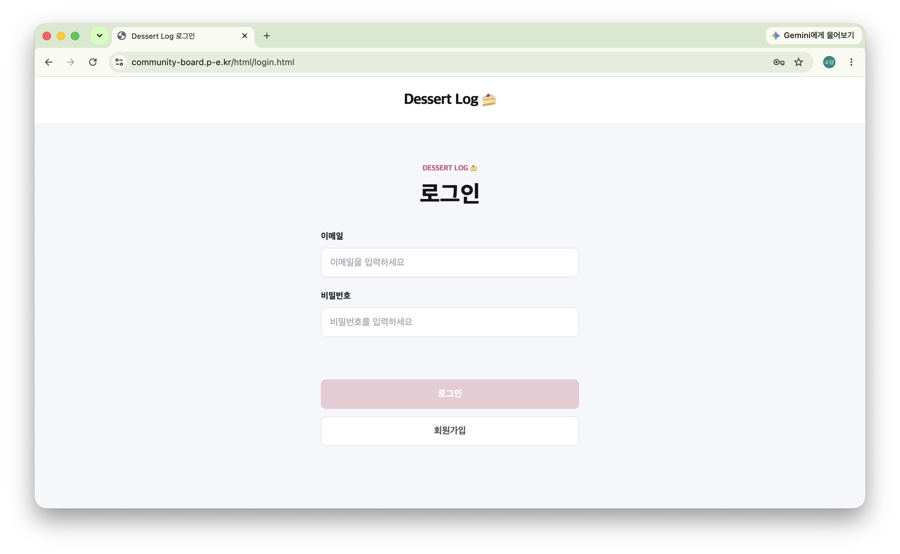 |

`게시글 작성 / 수정`

| 게시글 작성 | 게시글 수정 |
| --- | --- |
| 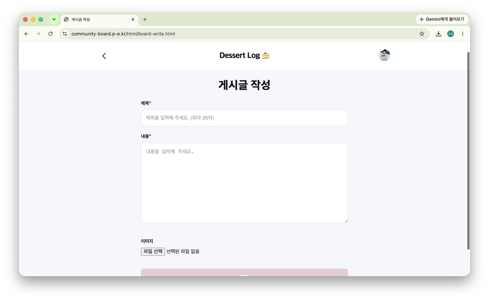 | 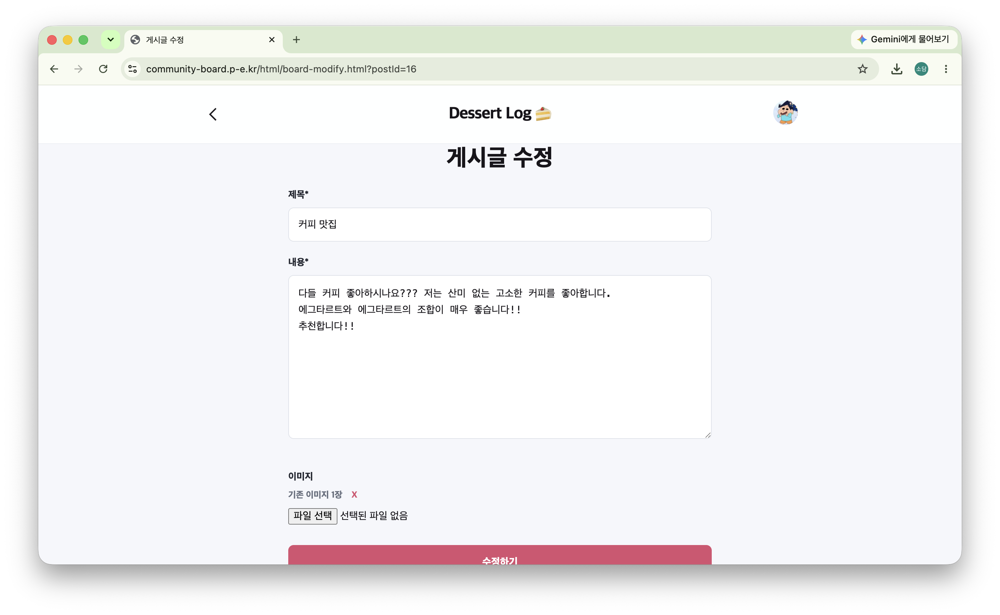 |

`게시글 삭제 / 댓글`

| 게시글 삭제 | 댓글 |
| --- | --- |
| 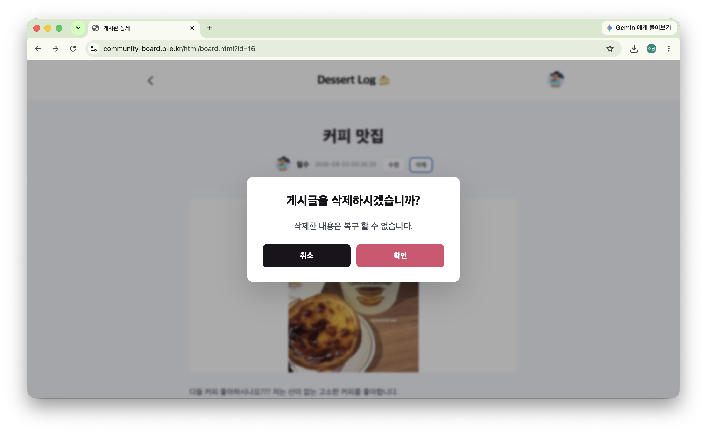 | 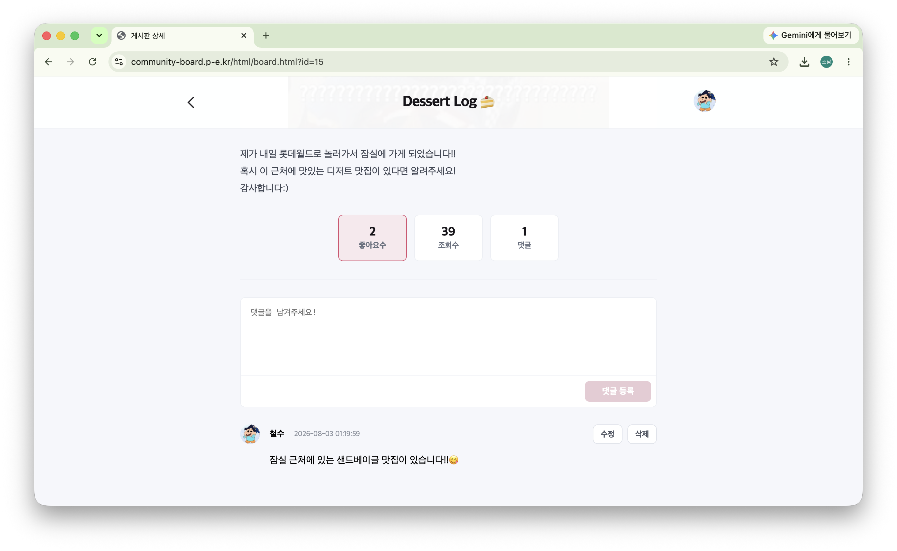 |

`댓글 수정 / 삭제`

| 댓글 수정 | 댓글 삭제 |
| --- | --- |
| 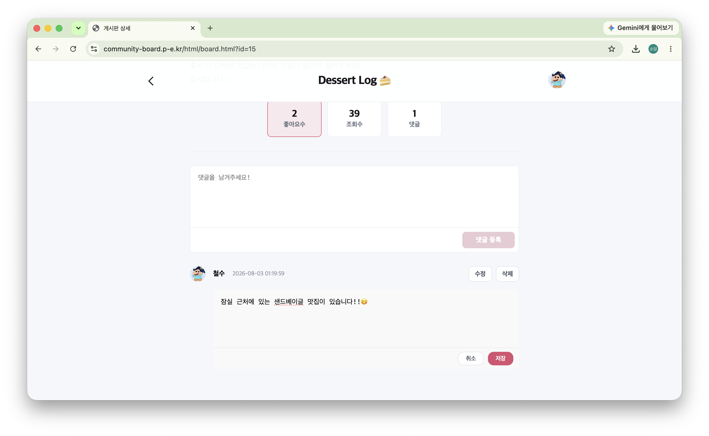 | 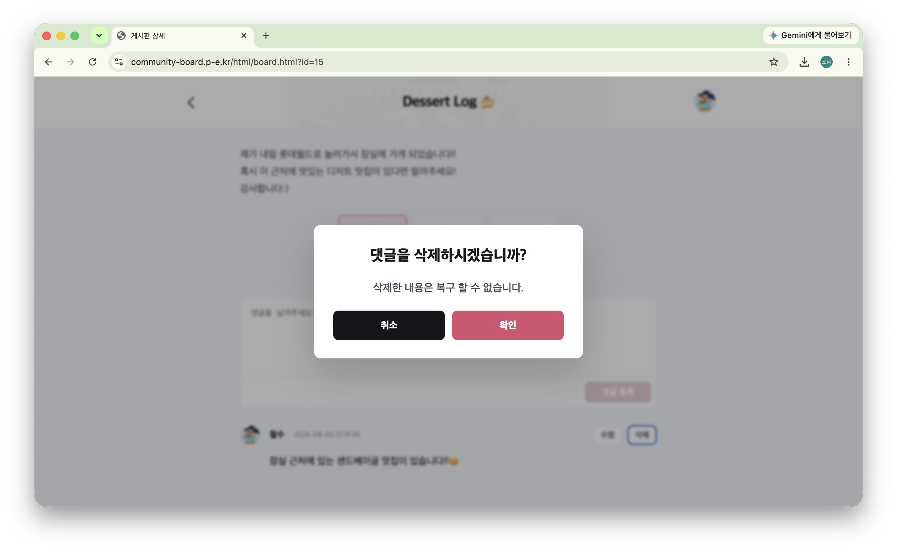 |

`인기글 랭킹 / 게시글 목록`

| 인기글 랭킹 | 게시글 목록 |
| --- | --- |
| 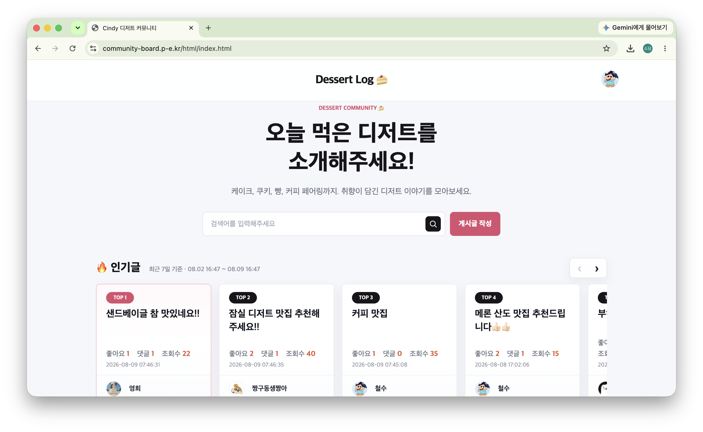 | 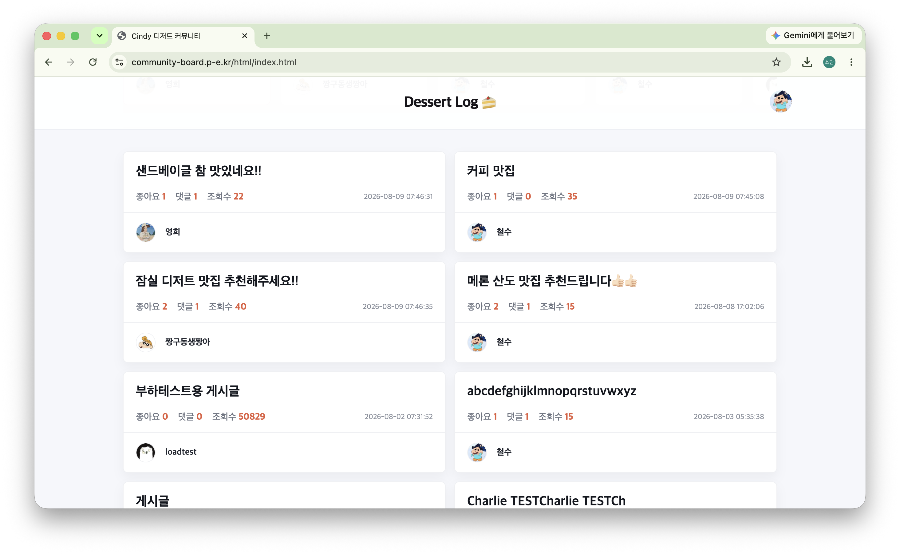 |

`회원 정보 수정 및 탈퇴 / 비밀번호 수정`

| 회원 정보 수정 및 탈퇴 | 비밀번호 수정 |
| --- | --- |
| 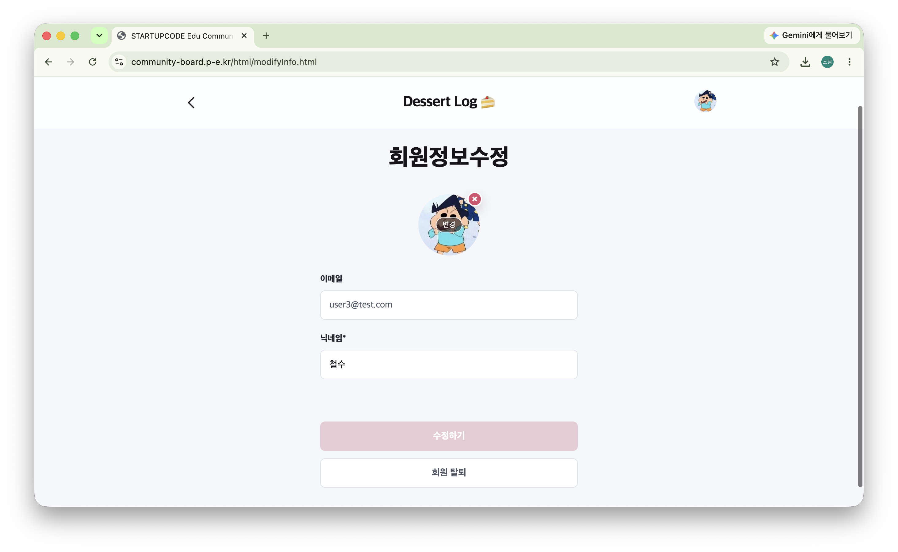 | 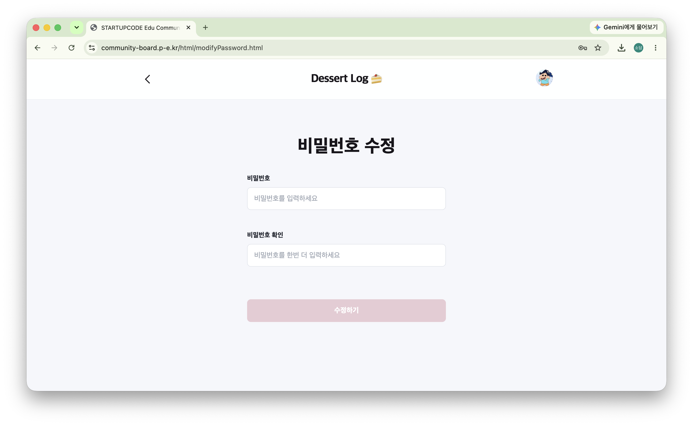 |
